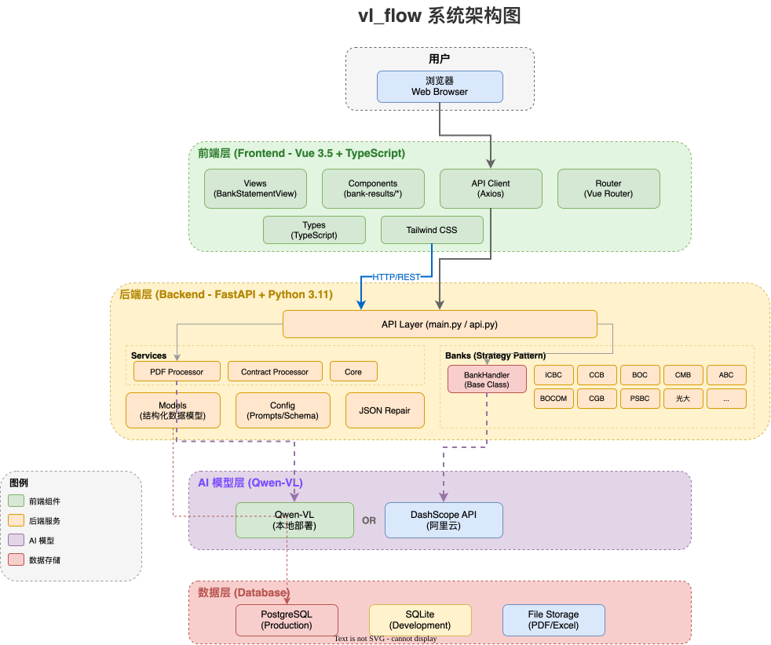

# 🌊 vlagent

[](https://www.python.org/downloads/)
[](https://nodejs.org/)
[](https://fastapi.tiangolo.com/)
[](https://vuejs.org/)
[](https://opensource.org/licenses/MIT)

**vlagent** 是一个基于 **Qwen-VL** 大模型的智能文档识别与分析平台。利用多模态模型能力，实现银行流水识别、询证函识别与格式比对、证件识别、发票识别、合同比对等多种文档智能处理功能。

---

## ✨ 核心功能

### 🏦 银行流水识别 (Multi-Bank Statement)

智能识别多种银行流水 PDF，自动提取账户信息、余额明细、交易双方等关键数据。

- **高精度识别**: 基于 Qwen-VL，支持复杂表格和跨页识别。
- **自动检测**: 自动识别银行类型，智能匹配识别策略。
- **一键导出**: 识别结果可直接导出为 Excel 文档。
- **跨页合并**: 自动处理跨页连续记录，确保数据完整性。
- **原生 PDF 解析**: 支持原生电子银行流水解析（无需 OCR），使用 pdfplumber/camelot 提取数据。
- **广泛支持**: 已适配 11 家银行（工行、农行、中行、建行、交行、招行、光大、广发、邮储、济宁银行、齐鲁银行）。

### 📝 询证函识别 (Confirmation Letter)

银行询证函的 AI 识别与结构化提取。

- **智能提取**: 自动识别函证编号、事务所名称、回函地址等 12 个关键字段。
- **人工修正**: 支持人工校对和修改识别结果。
- **分表存储**: 文件信息与识别结果独立存储，架构清晰。

### 📐 询证函格式比对 (Format Compare)

将询证函与标准模板进行 AI 格式比对，识别内容差异。

- **多模板支持**: 内置 3 种标准格式模板（格式一、格式二、验资报告）。
- **智能比对**: AI 自动识别格式类型，提取结构化内容并对比差异。
- **差异分级**: 按高/中/低严重级别标注差异项。

### 🪪 证件识别 (Credential Recognition)

AI 驱动的多类型证件/文书识别，提取结构化数据。

- **支持 8 种类型**: 身份证、电子印章、银行卡、电子凭证、网银申请书、违法行为告知书、开户申请书、授权委托书。
- **网格切片**: 对密集表单采用网格切片多图处理策略，提升识别精度。
- **符号判定**: 专门优化对勾/叉号等符号的识别准确率。

### 🧾 发票识别 (Invoice Recognition)

AI 发票信息提取，支持多种发票类型。

- **逐页识别**: 自动按页处理多页发票 PDF。
- **关键字段**: 提取发票类型、号码、日期、购/销方信息、税号、金额等。
- **异步处理**: 后台异步识别，前端轮询状态。

### 📄 合同比对 (Contract Compare)

智能比对两份合同文档的差异，精确定位变更内容。

- **逐段比对**: 基于文本段落的细粒度差异检测。
- **可视化展示**: 前端直观展示新增、删除、修改的内容。

### 📦 ECM 文件服务 (File Provider)

集成 SunECM 影像平台，提供文件上传、下载、查询、删除等操作。

- **Java SDK 集成**: 通过 JPype 调用 ECM Java SDK。
- **批量操作**: 支持多文件批量下载（自动打包 ZIP）。

---

## 🛠️ 技术栈

| 领域        | 技术选择                                                         |
| :---------- | :--------------------------------------------------------------- |
| **前端**    | Vue 3.5 + TypeScript 5.9 + Tailwind CSS 4.1 + Tiptap 3          |
| **后端**    | FastAPI 0.124 + SQLModel 0.0.27 + Python 3.11                    |
| **AI 模型** | Qwen-VL (Local Deployment) / DashScope API                       |
| **数据库**  | PostgreSQL (Production) / SQLite (Dev)                           |
| **PDF 处理**| pdfplumber + camelot + pdf2image + Pillow                        |
| **包管理**  | [uv](https://github.com/astral-sh/uv) (Backend) + npm (Frontend) |

---

## 🚀 快速开始

### 📋 环境要求

- **Python 3.11+**
- **Node.js 18+**
- **Poppler** (用于 PDF 转图片)
  - macOS: `brew install poppler`
  - Ubuntu: `sudo apt-get install poppler-utils`

### 1️⃣ 克隆与配置

```bash
git clone https://github.com/your-repo/vlagent.git
cd vlagent
```

### 2️⃣ 启动后端

```bash
cd backend
cp .env.example .env
# 编辑 .env 配置 LLM 地址与数据库连接
uv sync
uv run uvicorn main:app --reload --port 8000
```

### 3️⃣ 启动前端

```bash
cd frontend
npm install
npm run dev
```

访问 [http://localhost:5173](http://localhost:5173) 即可进入系统。

---

## 📁 项目结构

```
vlagent/
├── backend/                       # FastAPI 后端服务
│   ├── src/
│   │   ├── banks/                 # 银行流水处理器 (Strategy Pattern, 11家银行)
│   │   ├── models/                # 数据模型 (SQLModel)
│   │   ├── files/                 # 文件上传与识别管理
│   │   ├── transactions/          # 交易数据查询接口
│   │   ├── confirmation_letter/   # 询证函识别模块
│   │   ├── confirmation_compare/  # 询证函格式比对模块
│   │   ├── credentials/           # 证件识别模块
│   │   ├── invoice_recognition/   # 发票识别模块
│   │   ├── native_statement/      # 原生电子流水解析模块
│   │   ├── contracts/             # 合同比对模块
│   │   ├── legal_contact/         # 律师联系方式提取
│   │   └── file_provider/         # ECM 影像平台文件服务
│   ├── services/                  # PDF 处理、数据提取、Excel 导出等通用服务
│   └── config/                    # 识别提示词、Schema 配置、银行模板
├── frontend/                      # Vue 3 前端应用
│   ├── src/views/                 # 页面组件 (7个功能页面)
│   └── src/components/            # UI 组件 (bank-results/ 等)
├── docs/                          # 项目文档与部署指南
└── docker-compose.yml             # 容器化部署配置
```

---

## 🏗️ 架构概览



### 插件化银行处理器 (Strategy Pattern)

系统采用策略模式，添加新银行支持仅需 3 步：

1. **定义模型**: 在 `src/models` 添加数据结构。
2. **实现处理器**: 继承 `BankHandler` 并实现提取逻辑。
3. **配置提示词**: 在 `config/` 添加专属的 AI 提取提示词和 Schema。

---

## 🖥️ 部署

详细的虚拟机部署（在线/离线）和 Docker 部署方案请参考 [docs/DEPLOYMENT.md](docs/DEPLOYMENT.md)。

---

## 📄 开源协议

本项目采用 [MIT License](LICENSE) 开源协议。
