**银行询证函业务智能改造需求**

根据业务智能化和业务流程优化需要，以及集中作业平台改造需要，提出以下需求。

目前，针对纸质函银行询证函，由中心统一收函，中心审核格式、印章后扫描函证并录入相关信息，网点审核纸质函证信息，填写回函结论附页、回函信息、审批表后提交至集中作业，集中作业经办、复核岗审核支行扫描的函证结论附页与询证函、系统数据三者的一致性，将函证结论附页和回函页分别查找打印并由经办、复核岗签字，加盖函证公章，最终邮寄完成回函。其中，支行填写信息、审核来函信息的正确性等，以及中心审核来函信息以及回函信息准确性等操作不但繁琐且极易产生操作性风险。

监管机构于2024年发布了《财政部办公厅
金融监管总局办公厅关于印发\<银行函证工作操作指引\>的通知》(财办会〔2024〕2
号)
文件，根据文件要求，银行业金融机构函证回函时可采用通过系统打印的银行自有格式函证进行回复并签章。结合我行数智化业务发展和网点减负需要，提出纸质函证回函模式改造的需求。

项目改造完成后，将实现智能录入、系统生成回函文件信息、纸质和电子的业务优化等，减少支行和中心的人工操作。一方面，对于支行，无需填写函证信息、函证结论和附页，无需审核纸质函证原函中填写的十五个项目信息的规范性，以及填写内容与系统生成信息一致性，仅需对系统生成的回函信息进行确认，大幅减少支行手工填写和来函信息核对工作。另一方面，对于中心，无需审核纸质函证原件中填写的十五个项目信息的规范性，以及填写内容与系统生成信息一致性，无需审核函证结论附页等相关附件，减少中心人工核对工作；中心审核完成后，通过系统打印回函文件附电子签章，无需人工查找函证影像、结论附页并签章，提升打印效率，减少人工操作；通过智能识别，实现中心岗位部分信息的智能录入，减少人工录入工作。

## **第一部分 纸质函证信息的智能识别录入**

### **一、要素的识别带入/比对**

目前中心受理岗界面信息需要人工录入，包括户名、扣费账号、会计师事务所、收函地址、联系人、联系电话等信息，需通过智能O识别技术，将识别的内容自动带入中心受理岗界面相关字段，可以人工修改信息。智能识别的内容及识别规则如下（凭证及对应的字段1-12）

#### **（一）函证编号**

如无编号或识别不成功则识别为空值，函证编号字段不带入内容，人工录入。

收到的纸质函证中询证函编号展示方式多样化，常见关键字有：编号、函证编号、询证函编号、NO。

主要场景如下：

1.  右上角，有"编号"或"函证编号"或"询证函编号"字样，要识别抓取编号字样后内容，紧跟其后的"："不抓取。

    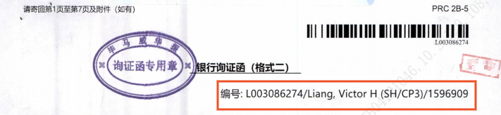{width="5.761805555555555in"
    height="1.3291666666666666in"}

    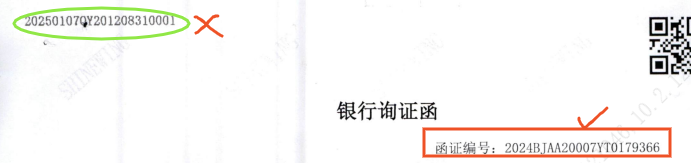{width="5.7652777777777775in"
    height="1.3597222222222223in"}

    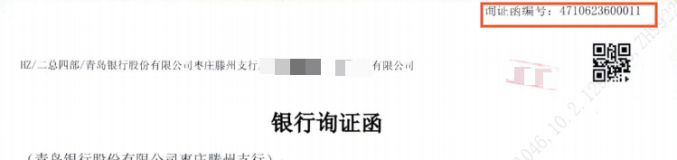{width="5.7659722222222225in"
    height="1.3625in"}

    部分询证函编号不抓取页码。

    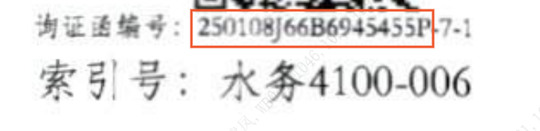{width="5.761805555555555in"
    height="1.4041666666666666in"}

    2.函证左上角或右上角有"编号"字样，要识别抓取编号字样后内容，紧跟其后的"："不抓取。

    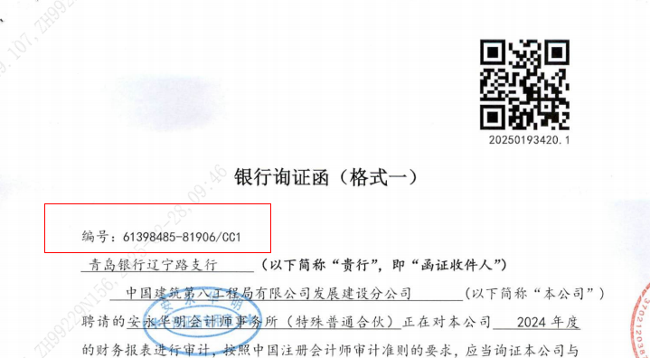{width="5.766666666666667in"
    height="1.7097222222222221in"}

    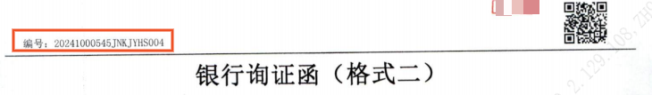{width="5.763888888888889in"
    height="0.8451388888888889in"}

    3.函证右上角或左上角，有"NO."字样，要识别抓取编号字样后内容。NO和紧跟其后的"."或"："不抓取。

    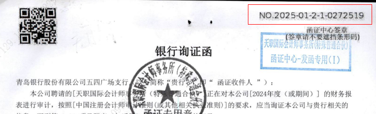{width="5.7659722222222225in"
    height="1.5069444444444444in"}

    4.函证左上角或右上角有"索引号"字样，要识别抓取索引号字样后内容，紧跟其后的"："不抓取。

    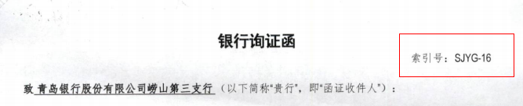{width="5.766666666666667in"
    height="1.1756944444444444in"}

    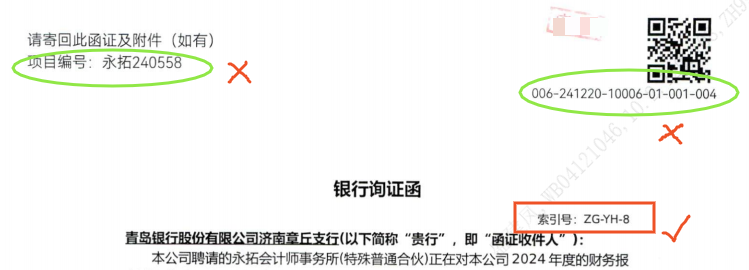{width="5.7659722222222225in"
    height="2.078472222222222in"}

<!-- -->

5.  函证左上角或右上角，无"函证编号"、"编号"、"索引号"、"NO."字样，抓取"条形码"处编号。

    （1）条形码下的编号

    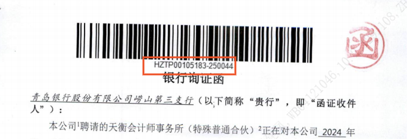{width="5.761805555555555in"
    height="1.9784722222222222in"}

    6.若函证中既有"函证编号""编号""索引号"等，按优先级抓取，具体描述下：

    编号抓取的优先规则为："函证编号"\>"询证函编号"\>"编号"\>"NO."\>"索引号"\>"项目编号"

    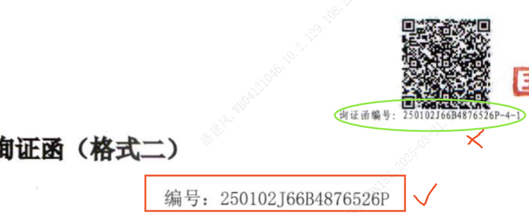{width="5.764583333333333in"
    height="2.3361111111111112in"}

    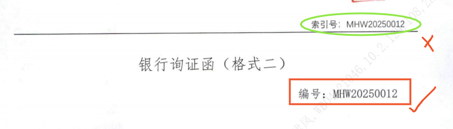{width="5.7659722222222225in"
    height="1.6506944444444445in"}

    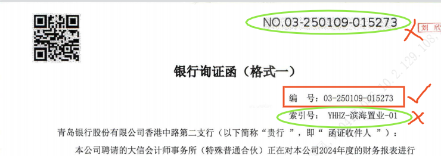{width="5.7659722222222225in"
    height="2.0416666666666665in"}

    编号为空，函证中同时有询证函编号与索引号，抓取询证函编号，但询证函编号不抓取页码。

    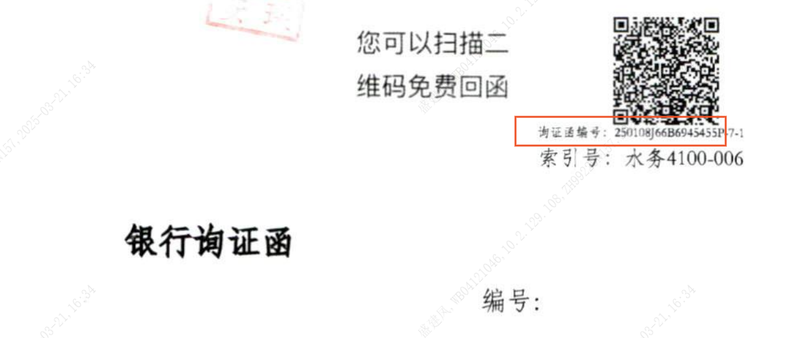{width="5.7659722222222225in"
    height="2.479861111111111in"}

#### **（二）事务所名称**

若识别不成功则识别为空值，事务所名称字段不带入内容，人工录入。

常见关键字有：本公司聘请的、本公司聘请的\[\]、本公司^1^聘请的、（以下简称"本公司"）聘请的。

事务所名称要抓取函证首页中相应内容，智能识别抓取的相应内容示例如下：

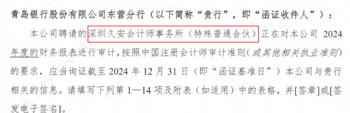{width="5.763194444444444in"
height="1.8680555555555556in"}

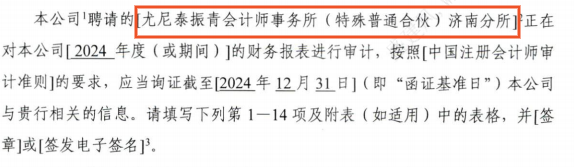{width="5.763888888888889in"
height="1.6770833333333333in"}

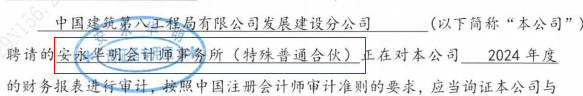{width="5.763194444444444in"
height="0.9493055555555555in"}

#### **（三）回函地址**

若识别不成功则识别为空值，回函地址字段不带入内容，人工录入。

常见同义词有：回函地址、收件地址、回函请寄、回函邮寄地址。

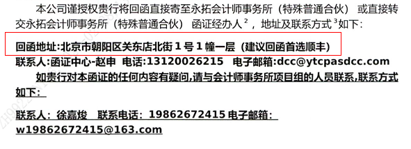{width="5.7625in"
height="2.0868055555555554in"}

#### **（四）联系人**

常见同义词有：联系人、收件人、回函快递收件人。

若识别不成功则识别为空值，字段不带入内容，人工录入。

#### **电话**

常见同义词有：电话、联系电话、收件手机号、收件电话、回函收件人及电话、。

若识别不成功则识别为空值，字段不带入内容，人工录入。

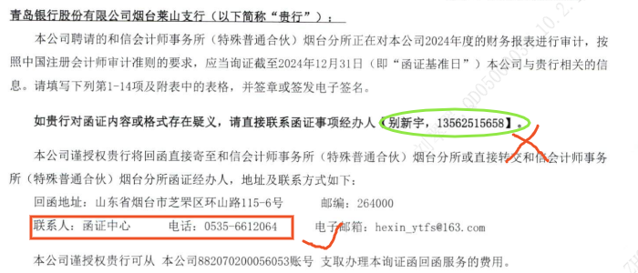{width="5.768055555555556in"
height="2.4722222222222223in"}

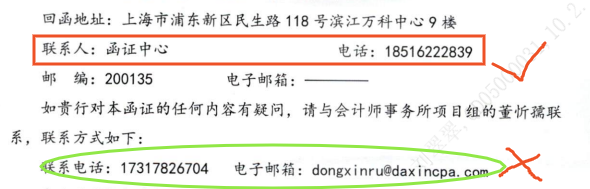{width="5.764583333333333in"
height="1.8465277777777778in"}

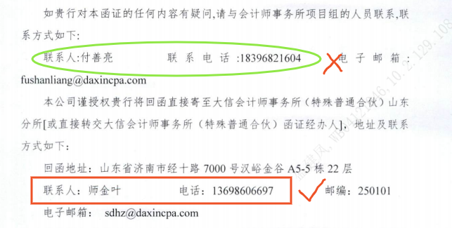{width="5.766666666666667in"
height="2.9145833333333333in"}

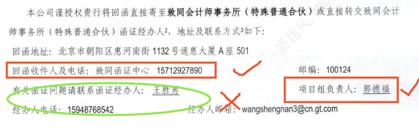{width="5.763194444444444in"
height="1.770138888888889in"}

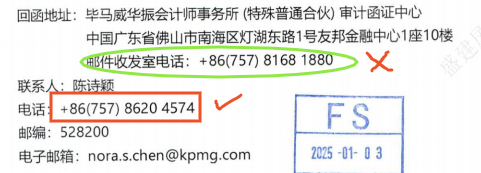{width="5.010416666666667in"
height="1.8020833333333333in"}

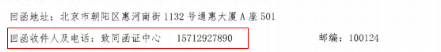{width="5.767361111111111in"
height="0.6833333333333333in"}

#### **（六）邮编**

若识别不成功则识别为空值，字段不带入内容，人工录入。

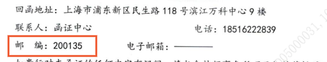{width="5.625in"
height="1.0729166666666667in"}

#### **（七）扣费账号**

若识别不成功则识别为空值，字段不带入内容，人工录入。

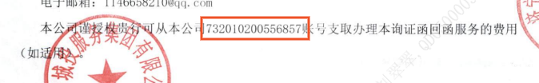{width="5.763888888888889in"
height="0.8895833333333333in"}

下列示例应无法识别成功，带入空值。

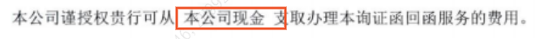{width="5.766666666666667in"
height="0.42083333333333334in"}

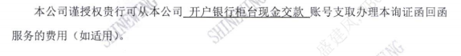{width="5.763888888888889in"
height="0.7027777777777777in"}

#### **（八）截止日期**

若识别不成功则识别为空值，字段不带入内容，人工录入。

1.格式一

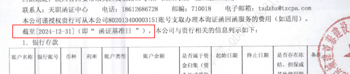{width="5.436111111111111in"
height="1.2270833333333333in"}

2.格式二

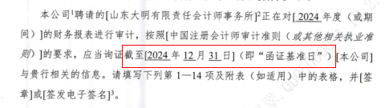{width="5.0in" height="1.40625in"}

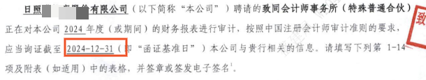{width="5.763194444444444in"
height="1.0868055555555556in"}

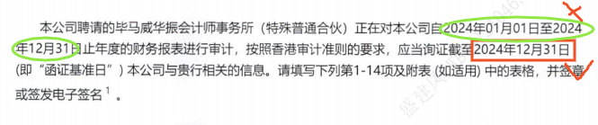{width="5.763194444444444in"
height="1.2048611111111112in"}

#### **（九）起始日期-终止日期**

若识别不成功则识别为空值，字段不带入内容，人工录入。

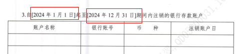{width="5.010416666666667in"
height="1.1354166666666667in"}

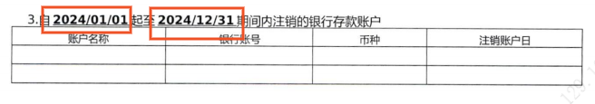{width="5.767361111111111in"
height="1.011111111111111in"}

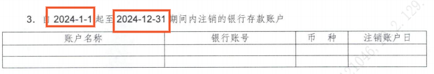{width="5.766666666666667in"
height="0.9916666666666667in"}

下列示例应无法识别成功，起始日期带入空值。

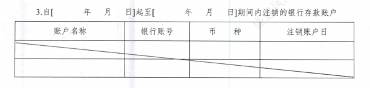{width="5.763194444444444in"
height="1.375in"}

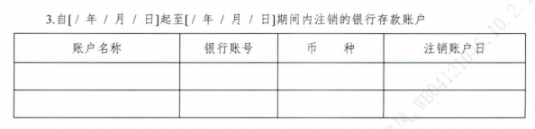{width="5.766666666666667in"
height="1.3979166666666667in"}

#### **（十）印章日期**

1.格式一

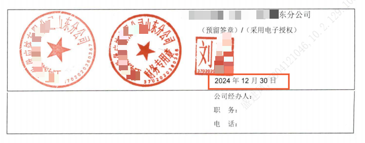{width="5.766666666666667in"
height="2.270138888888889in"}

2.格式二

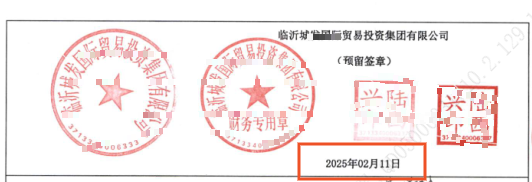{width="5.541666666666667in"
height="1.8958333333333333in"}

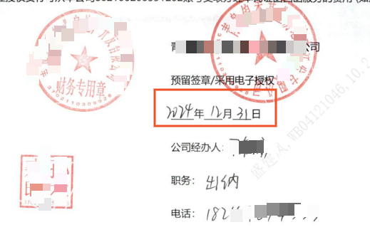{width="5.40625in" height="3.46875in"}

#### **（十一）印章名称**

若识别不成功则识别为空值，字段不带入内容，人工录入。

#### **（十二）落款名称**

如果有落款名称则抓取比对，如果没有，则不抓取

**二、函证格式识别比对**

目前询证函的格式需人工逐项核对，存在耗费时间较多且容易出现格式有误未发现问题。

对于函证格式一、格式二，验资询证函，需要智能识别函证格式，包括询证的事项，每一个项目的描述以及字段，将项目表述，以及表格字段与模板中的格式比对，不一致的内容在标准化模板中不符处标深红色，若无法做到，请技术提供更优化方案。比如存款项中账户名称写成账号名称，则校验后，打开标准化模板，则账户名称字段红色展示。
