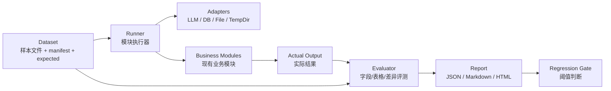

# vlagent Harness 工程设计及实施方案

## 1. 背景与结论

vlagent 是一个围绕智能文档识别与分析构建的业务系统，后端基于 FastAPI，核心能力包括银行流水识别、原生电子流水解析、询证函识别、询证函格式比对、证件识别、发票识别、文档比对和 ECM 文件服务。

从当前代码结构看，vlagent 不适合整体改造成一个单一的 harness 工程。更合理的方式是保留现有业务系统形态，在后端旁路增加一层模块级 harness，用它来驱动样本、回放流程、比较结果、沉淀指标和控制回归风险。

本方案建议采用：

```text
业务系统主体不变 + 模块级 harness + 样本集 + 评测器 + 报告与回归门禁
```

优先 harness 化的模块为：

1. 银行流水识别
2. 原生电子流水解析
3. 询证函识别与格式比对
4. 发票识别与证件识别

不建议作为第一阶段 harness 核心的模块为：

- 前端页面：更适合 E2E 测试。
- ECM 文件服务：更适合 mock integration test。
- 用户、权限、上传、下载、数据库 CRUD：作为被调用依赖即可，不应成为 harness 主体。

## 2. Harness 在本项目中的定义

本项目中的 harness 不是简单的 pytest，也不是独立替换业务系统的框架，而是一套用于 AI 文档处理模块的工程化验证层。

它需要具备以下能力：

1. 样本驱动：用固定输入样本反复运行同一模块。
2. 结果可比较：把实际输出与期望输出进行结构化比较。
3. 依赖可替换：LLM、数据库、文件存储、临时目录等依赖可以 mock、stub 或 replay。
4. 过程可追踪：保存输入、输出、耗时、模型配置、prompt hash、代码版本、错误信息。
5. 指标可量化：字段准确率、交易行召回率、金额一致性、格式差异检出率等。
6. 回归可门禁：在 CI 或本地命令中判断本次改动是否造成明显退化。

## 3. 建设目标

### 3.1 主要目标

1. 为核心文档识别模块建立稳定的回归验证机制。
2. 支持不同 prompt、schema、解析规则、模型版本之间的横向对比。
3. 将人工抽样判断转化为可重复执行的批量评测。
4. 降低新增银行、新增模板、新增证件类型时的回归风险。
5. 为后续模型选型、prompt 优化和规则调优提供客观指标。

### 3.2 非目标

1. 不重写现有 FastAPI 路由体系。
2. 不要求第一阶段将所有业务代码改造成纯函数。
3. 不把真实客户敏感文件直接提交到 Git。
4. 不用 harness 替代单元测试、接口测试和前端 E2E 测试。
5. 不在第一阶段建设复杂 Web 管理台，先以 CLI 和静态报告为主。

## 4. 总体架构

### 4.1 架构图



### 4.2 推荐目录结构

建议在 `backend/` 内新增 harness 工程目录，避免与前端和部署资源混杂：

```text
backend/
  harness/
    __init__.py
    cli.py
    README.md

    core/
      __init__.py
      manifest.py
      runner.py
      result.py
      evaluator.py
      report.py
      normalize.py
      artifacts.py

    adapters/
      __init__.py
      llm.py
      db.py
      file_store.py
      temp_dir.py

    modules/
      __init__.py
      native_statement/
        __init__.py
        runner.py
        evaluator.py
        normalizer.py
      bank_statement/
        __init__.py
        runner.py
        evaluator.py
        normalizer.py
      confirmation_letter/
        __init__.py
        runner.py
        evaluator.py
        normalizer.py
      confirmation_compare/
        __init__.py
        runner.py
        evaluator.py
        normalizer.py
      invoice/
        __init__.py
        runner.py
        evaluator.py
        normalizer.py
      credential/
        __init__.py
        runner.py
        evaluator.py
        normalizer.py

    datasets/
      README.md
      native_statement/
        manifest.json
        expected/
        samples/
      confirmation_letter/
        manifest.json
        expected/
        samples/

    reports/
      .gitkeep
```

如果样本含敏感数据，建议将 `backend/harness/datasets/*/samples` 放入 `.gitignore`，仓库内只保留脱敏样本或 manifest 示例。

### 4.3 核心对象模型

#### Dataset Manifest

每个 harness suite 使用一个 `manifest.json` 描述样本、期望结果和运行参数。

示例：

```json
{
  "suite": "native_statement",
  "version": "1.0",
  "description": "原生电子流水解析回归集",
  "samples": [
    {
      "id": "cmb_native_001",
      "input": "samples/cmb/native_001.pdf",
      "expected": "expected/cmb_native_001.json",
      "tags": ["cmb", "native_pdf", "normal"],
      "bank_type": "cmb",
      "case_level": "smoke"
    }
  ]
}
```

#### Expected Output

期望结果应尽量使用模块的业务输出结构，而不是 UI 展示结构。

原生流水示例：

```json
{
  "bank_type": "cmb",
  "is_native": true,
  "summary": {
    "account_name": "脱敏公司名称",
    "account_no": "****1234",
    "currency": "CNY"
  },
  "transactions": [
    {
      "date": "2025-01-02",
      "debit": "100.00",
      "credit": "",
      "balance": "900.00",
      "counterparty": "脱敏对手方",
      "summary": "转账"
    }
  ]
}
```

#### Run Result

每次运行都生成统一结果对象，便于报告聚合：

```json
{
  "run_id": "20260509_153000",
  "suite": "native_statement",
  "sample_id": "cmb_native_001",
  "status": "passed",
  "metrics": {
    "field_accuracy": 0.98,
    "transaction_row_recall": 1.0,
    "amount_consistency": 1.0
  },
  "duration_ms": 1830,
  "artifacts": {
    "actual": "reports/20260509_153000/cmb_native_001.actual.json",
    "diff": "reports/20260509_153000/cmb_native_001.diff.json"
  },
  "error": null
}
```

## 5. 分模块设计

### 5.1 银行流水识别 Harness

#### 适配原因

银行流水识别是最适合 harness 化的模块。当前项目已经具备以下基础：

- `src/banks/base.py` 定义了 `BankHandler` 抽象基类和注册表。
- `services/pdf/bank_detector.py` 提供银行类型检测。
- `services/pdf/data_extractor.py` 提供基于 schema 和 prompt 的 AI 提取。
- `config/bank_schemas/` 和 `config/prompts/` 已经按银行拆分配置。
- 多家银行 handler 已按策略模式拆分。

#### 目标能力

1. 批量运行不同银行样本。
2. 验证银行识别是否正确。
3. 验证 summary 字段准确率。
4. 验证交易行数量、金额、日期、对方户名、摘要等字段。
5. 验证跨页合并、空行过滤、噪声过滤是否正确。
6. 支持比较不同 prompt、不同模型、不同 schema 的效果。

#### 推荐输入

```text
PDF / 图片
银行类型标签
期望 summary
期望 transactions
可选：页级标注、跨页记录标注、特殊 case 标签
```

#### Runner 设计

`harness/modules/bank_statement/runner.py` 负责：

1. 读取样本文件。
2. PDF 转图片。
3. 调用银行检测。
4. 调用对应 schema 和 prompt。
5. 调用 AI 提取或 replay 缓存。
6. 执行业务后处理。
7. 输出标准化 JSON。

第一阶段可以先绕开数据库，直接评测提取结果；第二阶段再接入 handler 的 `create_records()` 验证入库对象结构。

#### Evaluator 设计

核心指标：

| 指标 | 说明 |
| --- | --- |
| bank_detection_accuracy | 银行类型识别准确率 |
| summary_field_accuracy | 汇总字段准确率 |
| transaction_row_recall | 交易行召回率 |
| transaction_row_precision | 交易行精确率 |
| amount_accuracy | 借贷金额、余额准确率 |
| date_accuracy | 交易日期准确率 |
| counterparty_accuracy | 对方户名/账号准确率 |
| cross_page_merge_accuracy | 跨页合并准确率 |
| parse_success_rate | 样本成功处理比例 |

交易行匹配建议使用多字段联合匹配：

```text
date + debit/credit + balance + counterparty
```

金额字段先做数值标准化，再比较：

```text
"1,000.00" == "1000.00"
"¥100.0" == "100.00"
```

#### 优先样本集

1. 每家银行至少 3 个 smoke 样本。
2. 每家银行至少 1 个多页样本。
3. 广发、招行、济宁等特殊格式银行优先补充边界样本。
4. 每类异常样本至少 1 个：空页、扫描不清、跨页断行、无银行关键词文件名。

### 5.2 原生电子流水解析 Harness

#### 适配原因

原生电子流水解析不依赖 LLM，主要依赖 pdfplumber、camelot 和规则解析，结果确定性更强，非常适合作为第一阶段落地模块。

当前项目已有：

- `src/native_statement/parser.py`
- `src/native_statement/parser_v2.py`
- `src/native_statement/bank_rules.py`
- `src/native_statement/exporter.py`
- `tests/test_batch_native_statement.py`

#### 目标能力

1. 验证 PDF 是否被正确识别为原生电子版。
2. 验证银行类型检测。
3. 验证表头映射。
4. 验证交易行解析。
5. 验证 summary 正则提取。
6. 比较 parser v1 和 parser v2 的结果差异。

#### Runner 设计

`harness/modules/native_statement/runner.py`：

1. 调用 `is_native_pdf(pdf_path)`。
2. 调用 `parse_native_pdf(pdf_path)`。
3. 标准化输出字段。
4. 保存 actual JSON。

可支持参数：

```text
--parser v1
--parser v2
--export-excel
```

#### Evaluator 设计

核心指标：

| 指标 | 说明 |
| --- | --- |
| native_detection_accuracy | 原生 PDF 判断准确率 |
| bank_type_accuracy | 银行类型识别准确率 |
| summary_field_accuracy | 汇总字段准确率 |
| transaction_count_delta | 交易行数量差异 |
| transaction_exact_match_rate | 交易行完全匹配率 |
| amount_consistency | 借贷发生额和余额一致性 |
| required_field_completeness | 必填字段完整率 |

#### 快速落地建议

第一阶段直接把 `tests/test_batch_native_statement.py` 的批处理能力迁移为 harness runner，再补充 expected JSON 比对。这是投入产出比最高的起点。

### 5.3 询证函识别 Harness

#### 适配原因

询证函识别字段明确，并且当前服务中已经沉淀了大量后处理规则和幻觉修正规则，适合做字段级评测。

当前项目已有：

- `src/confirmation_letter/service.py`
- `extract_fields_from_images(image_paths)`
- `process_confirmation_letter(pdf_path)`
- 13 个核心识别字段
- 规则修正和 raw_text 交叉验证逻辑

#### 目标能力

1. 验证 13 个字段的提取准确率。
2. 验证日期标准化是否正确。
3. 验证高频幻觉修正规则是否生效。
4. 验证联系人、电话、银行抬头等易错字段。
5. 支持多页询证函样本。

#### 字段分级

建议把字段按重要性分级，评测时赋予不同权重：

| 等级 | 字段 |
| --- | --- |
| P0 | confirmation_no, recipient_bank, accounting_firm, reply_address, contact_person, phone |
| P1 | cutoff_date, start_date, end_date, seal_date, signature_name |
| P2 | postal_code, debit_account, raw_text |

#### Evaluator 设计

字段比较规则：

1. 编号字段：去除空格、页码后缀后精确比较。
2. 日期字段：统一成 `YYYY-MM-DD` 后比较。
3. 电话字段：提取数字和分隔符后比较，支持多个号码集合比较。
4. 地址和名称字段：默认精确比较，可增加轻量归一化。
5. raw_text：不做全文精确比较，只检查关键片段覆盖率。

核心指标：

| 指标 | 说明 |
| --- | --- |
| field_exact_accuracy | 字段精确准确率 |
| p0_field_accuracy | P0 字段准确率 |
| hallucination_rate | 字段值不在 raw_text 中的比例 |
| missing_required_rate | 必填字段缺失率 |
| date_normalization_accuracy | 日期归一准确率 |

### 5.4 询证函格式比对 Harness

#### 适配原因

格式比对模块具有清晰模板和差异输出，适合建设结构化评测。

当前项目已有：

- `src/confirmation_compare/service.py`
- `config/confirmation_compare_templates/template1.json`
- `config/confirmation_compare_templates/template2.json`
- `config/confirmation_compare_templates/template3.json`
- `compare_with_template(pdf_path)`

#### 目标能力

1. 验证格式类型识别。
2. 验证 section 提取完整性。
3. 验证 table_headers 提取准确性。
4. 验证差异项召回率和误报率。
5. 验证 severity 分级。

#### Evaluator 设计

核心指标：

| 指标 | 说明 |
| --- | --- |
| format_type_accuracy | 格式类型识别准确率 |
| section_recall | 模板节次召回率 |
| header_recall | 表头召回率 |
| diff_recall | 差异项召回率 |
| diff_precision | 差异项精确率 |
| severity_accuracy | 严重级别准确率 |

期望结果示例：

```json
{
  "format_type": "format_1",
  "expected_differences": [
    {
      "section": "1. 银行存款",
      "item": "表头",
      "expected": "银行账号",
      "actual": "账号",
      "severity": "medium"
    }
  ]
}
```

### 5.5 发票识别 Harness

#### 适配原因

发票识别字段数量少，适合用作轻量 LLM 字段提取 harness。

当前项目已有：

- `src/invoice_recognition/service.py`
- `_extract_invoice_info(image_path)`
- `INVOICE_EXTRACTION_PROMPT`

#### 目标能力

1. 验证发票号码、日期、购销方、税号、金额。
2. 验证金额归一化。
3. 验证多页 PDF 按页识别。
4. 验证失败页的错误信息。

#### 核心指标

| 指标 | 说明 |
| --- | --- |
| invoice_no_accuracy | 发票号码准确率 |
| amount_accuracy | 金额准确率 |
| buyer_seller_accuracy | 购销方字段准确率 |
| tax_id_accuracy | 税号准确率 |
| page_success_rate | 页级识别成功率 |

### 5.6 证件识别 Harness

#### 适配原因

证件识别支持多类型文档，且存在网格切片等策略，适合做按类型分组的样本评测。

当前项目已有：

- `src/credentials/service.py`
- `extract_fields_from_images(image_paths, credential_type)`
- `process_credential(file_path, credential_type)`
- `src/credentials/prompts.py`

#### 目标能力

1. 按 credential_type 分组评测。
2. 验证字段提取准确率。
3. 验证网格切片策略对密集表单的效果。
4. 验证勾选、叉号等符号识别。

#### 核心指标

| 指标 | 说明 |
| --- | --- |
| field_accuracy_by_type | 按证件类型统计字段准确率 |
| checkbox_accuracy | 勾选/叉号识别准确率 |
| required_field_completeness | 必填字段完整率 |
| symbol_false_positive_rate | 符号误报率 |

## 6. 依赖注入与 Replay 设计

### 6.1 LLM Adapter

当前多个模块直接调用 `services.core.request_ai.request_qwen35`。短期内可以通过 runner 层 monkeypatch 或包装函数实现 replay；中期建议逐步改造为可注入 adapter。

推荐接口：

```python
class LLMAdapter:
    def ask(self, question: str, file_base: str | None = None, file_ary: list[str] | None = None, **kwargs) -> str:
        ...
```

实现类型：

| Adapter | 用途 |
| --- | --- |
| LiveLLMAdapter | 调真实模型 |
| ReplayLLMAdapter | 读取历史响应，保证可重复 |
| RecordingLLMAdapter | 调真实模型并记录请求/响应 |
| FakeLLMAdapter | 单元测试中返回固定结果 |

### 6.2 Replay 缓存键

Replay key 建议由以下内容生成：

```text
module + sample_id + prompt_hash + input_file_hash + model_name + adapter_version
```

这样可以区分 prompt 调整、样本调整和模型调整。

### 6.3 数据库 Adapter

第一阶段尽量绕开数据库，直接评测纯业务输出。

需要验证入库逻辑时，使用以下方案之一：

1. SQLite 临时库。
2. SQLModel session fixture。
3. In-memory repository stub。

银行流水 handler 的 `create_records()` 可以先直接评测返回对象，不一定要落库。

### 6.4 文件与临时目录 Adapter

当前代码中存在直接创建临时目录、拆 PDF、保存图片的逻辑。harness 应统一将中间产物保存到本次 run 的 artifacts 目录，便于排查。

建议 artifacts 结构：

```text
backend/harness/reports/20260509_153000/
  summary.json
  summary.md
  samples/
    cmb_native_001/
      actual.json
      expected.json
      diff.json
      pages/
      llm_requests/
      llm_responses/
```

## 7. 标准化与比较规则

### 7.1 通用标准化

所有 evaluator 比较前都应做标准化：

| 类型 | 标准化规则 |
| --- | --- |
| 字符串 | trim、合并空白、全角半角转换 |
| 日期 | 统一为 `YYYY-MM-DD` |
| 金额 | 去币种符号、逗号，转 Decimal |
| 账号 | 支持脱敏比较，保留后四位或 hash |
| 电话 | 提取数字，多个号码按集合比较 |
| 表头 | 去空白，统一中英文括号 |

### 7.2 字段比较类型

| 类型 | 适用场景 |
| --- | --- |
| exact | 编号、税号、金额、日期 |
| normalized_exact | 名称、地址、表头 |
| set_equal | 多电话、多账号 |
| contains | raw_text 关键片段 |
| numeric_equal | 金额、余额 |
| row_match | 银行流水交易行 |

## 8. CLI 设计

### 8.1 基础命令

建议使用 Python 标准库 `argparse` 起步，不额外引入 CLI 依赖。

```bash
cd backend
uv run python -m harness.cli list

uv run python -m harness.cli run \
  --suite native_statement \
  --manifest harness/datasets/native_statement/manifest.json

uv run python -m harness.cli run \
  --suite confirmation_letter \
  --manifest harness/datasets/confirmation_letter/manifest.json \
  --llm-mode replay

uv run python -m harness.cli compare \
  --baseline reports/20260501_100000/summary.json \
  --current reports/20260509_153000/summary.json
```

### 8.2 运行模式

| 模式 | 说明 |
| --- | --- |
| live | 调真实模型，适合调参和验收 |
| record | 调真实模型并记录响应 |
| replay | 使用历史响应，适合 CI 和回归 |
| dry-run | 只校验 manifest、样本和 expected |

### 8.3 输出报告

每次运行至少输出：

1. `summary.json`：机器可读，供 CI 判断。
2. `summary.md`：人工阅读。
3. 每个样本的 `actual.json`。
4. 每个失败样本的 `diff.json`。
5. 可选 HTML 报告。

## 9. 回归门禁设计

### 9.1 推荐阈值

第一阶段先使用宽松阈值，避免阻塞正常开发；样本稳定后逐步收紧。

| Suite | 指标 | 初始阈值 |
| --- | --- | --- |
| native_statement | parse_success_rate | >= 0.95 |
| native_statement | amount_consistency | >= 0.98 |
| native_statement | transaction_row_recall | >= 0.95 |
| bank_statement | bank_detection_accuracy | >= 0.95 |
| bank_statement | amount_accuracy | >= 0.95 |
| confirmation_letter | p0_field_accuracy | >= 0.90 |
| confirmation_compare | format_type_accuracy | >= 0.95 |
| invoice | amount_accuracy | >= 0.98 |

### 9.2 CI 建议

CI 中不建议默认调用真实 LLM。推荐：

1. PR 必跑：原生流水 deterministic harness。
2. PR 必跑：LLM 模块 replay harness。
3. 每日定时：LLM 模块 live harness。
4. 发布前：全量 live harness。

## 10. 数据治理与安全

### 10.1 样本分级

| 级别 | 说明 | 是否入 Git |
| --- | --- | --- |
| public_dummy | 人造样本 | 可以 |
| sanitized | 脱敏真实样本 | 谨慎，可以 |
| sensitive | 真实敏感样本 | 不可以 |

### 10.2 脱敏要求

1. 公司名称、姓名、账号、电话、地址、税号必须脱敏。
2. 金额可以按比例缩放，但 expected 要同步更新。
3. PDF 样本若无法可靠脱敏，不进入 Git。
4. manifest 中不写绝对路径和真实客户名称。
5. 报告中默认不输出完整 raw_text，可只输出 diff 片段。

### 10.3 数据集存放建议

如果样本敏感，建议：

```text
backend/harness/datasets/
  examples/        # 可提交

/secure/vlagent-harness-datasets/
  native_statement/
  bank_statement/
  confirmation_letter/
```

CLI 通过 `--manifest` 指向本地安全路径。

## 11. 实施路线图

### 阶段 0：准备与边界确认

周期：1 到 2 天

工作项：

1. 确认 harness 的第一批覆盖模块。
2. 确认样本数据是否允许脱敏入库。
3. 确认报告输出格式。
4. 确认 CI 是否有真实 LLM 访问权限。

交付物：

1. harness 目录骨架。
2. datasets README。
3. manifest 示例。
4. 第一版指标口径文档。

验收标准：

1. 团队对 harness 范围达成一致。
2. 可以用 dry-run 校验 manifest。

### 阶段 1：Harness Core 骨架

周期：3 到 5 天

工作项：

1. 新增 `backend/harness/cli.py`。
2. 新增 manifest 加载与校验。
3. 新增 runner/evaluator 抽象接口。
4. 新增 artifacts 管理。
5. 新增 JSON 和 Markdown 报告。
6. 新增通用 normalizer。

交付物：

1. `harness.cli list`
2. `harness.cli run --suite ...`
3. `summary.json`
4. `summary.md`

验收标准：

1. dry-run 可以检查样本路径、expected 路径和 suite 配置。
2. 空 runner 可以生成合法报告。

### 阶段 2：原生电子流水 Harness

周期：3 到 5 天

工作项：

1. 将 `tests/test_batch_native_statement.py` 的批处理逻辑迁移为 runner。
2. 接入 `src.native_statement.parser.parse_native_pdf`。
3. 支持 parser v1/v2 参数。
4. 实现交易行和 summary evaluator。
5. 准备每家银行 smoke 样本。

交付物：

1. `native_statement` suite。
2. 至少 10 个样本。
3. parser v1/v2 对比报告。

验收标准：

1. 本地一条命令跑完整个 suite。
2. 每个失败样本都有 diff。
3. 报告能展示银行、页数、交易行数、失败原因。

### 阶段 3：询证函识别与格式比对 Harness

周期：5 到 8 天

工作项：

1. 接入 `process_confirmation_letter(pdf_path)`。
2. 实现字段级 evaluator。
3. 接入 `compare_with_template(pdf_path)`。
4. 实现格式类型、section、header、diff evaluator。
5. 增加 replay adapter，避免每次重复调用真实模型。

交付物：

1. `confirmation_letter` suite。
2. `confirmation_compare` suite。
3. LLM replay 缓存机制。
4. P0/P1/P2 字段分级报告。

验收标准：

1. replay 模式下结果完全可重复。
2. live 模式下能记录模型响应。
3. 报告能明确展示错字段、期望值、实际值。

### 阶段 4：银行扫描流水 Harness

周期：8 到 12 天

工作项：

1. 接入 PDF 转图片、银行检测、schema 加载、AI 提取。
2. 建立多银行样本 manifest。
3. 实现交易行匹配算法。
4. 实现跨页合并专项指标。
5. 对接 `BankHandler.create_records()` 验证持久化对象。

交付物：

1. `bank_statement` suite。
2. 每家银行至少 3 个样本。
3. 银行级指标报告。
4. prompt/schema 对比报告。

验收标准：

1. 可以按银行过滤运行：`--tag cmb`。
2. 可以比较两次运行的指标差异。
3. 可以定位到具体交易行差异。

### 阶段 5：发票与证件 Harness

周期：5 到 8 天

工作项：

1. 接入发票 `_extract_invoice_info` 或外层处理流程。
2. 接入证件 `process_credential`。
3. 实现金额、税号、日期、符号识别 evaluator。
4. 按文档类型输出分组指标。

交付物：

1. `invoice` suite。
2. `credential` suite。
3. 多类型字段准确率报告。

验收标准：

1. 发票金额、发票号、税号有独立指标。
2. 证件按 credential_type 分组统计。

### 阶段 6：CI 与持续治理

周期：3 到 5 天

工作项：

1. 增加 CI 命令。
2. 配置 replay suite 为 PR 门禁。
3. 配置 live suite 为每日任务。
4. 建立 baseline 更新流程。
5. 增加失败样本归档和复盘流程。

交付物：

1. CI 配置。
2. baseline 报告。
3. 回归阈值配置。
4. 样本新增规范。

验收标准：

1. PR 中 deterministic/replay harness 可以稳定运行。
2. 指标低于阈值时 CI 失败。
3. baseline 更新需要人工确认。

## 12. 代码改造建议

### 12.1 短期改造

短期以“少侵入”为原则：

1. 不改现有 API 路由。
2. harness runner 直接调用现有 service 函数。
3. 对直接 LLM 调用先使用 replay monkeypatch。
4. 对数据库相关流程先绕开或使用临时库。

### 12.2 中期改造

中期逐步提高可测试性：

1. 将 LLM 调用从业务函数中抽成 adapter。
2. 将 PDF 转图片、临时目录、文件保存抽成可替换依赖。
3. 将后处理逻辑拆成纯函数。
4. 将 prompt 构造函数显式暴露，便于计算 prompt hash。
5. 将标准输出结构固定为 Pydantic model 或 TypedDict。

### 12.3 长期改造

长期可以形成“开发即评测”的工程循环：

1. 每次 prompt 修改自动跑对应 suite。
2. 每次新增银行必须新增样本和 expected。
3. 每次新增字段必须更新 evaluator。
4. 线上误识别案例脱敏后进入回归集。
5. 关键指标持续趋势化展示。

## 13. 样本新增流程

新增一个 harness 样本时，应遵循以下流程：

1. 获取样本文件。
2. 完成脱敏或确认仅本地保存。
3. 在 manifest 中新增 sample。
4. 人工标注 expected JSON。
5. 运行 harness。
6. 检查 diff。
7. 如果 expected 有误，修正 expected。
8. 如果业务有误，修复业务逻辑。
9. 将该样本纳入 smoke 或 regression 标签。

推荐标签：

```text
smoke
regression
edge_case
multi_page
poor_scan
native_pdf
llm
no_llm
bank:cmb
bank:icbc
doc:confirmation
doc:invoice
```

## 14. 风险与应对

| 风险 | 影响 | 应对 |
| --- | --- | --- |
| 样本含敏感信息 | 数据安全风险 | 样本分级、脱敏、敏感样本不入 Git |
| LLM 输出不稳定 | CI 抖动 | PR 使用 replay，每日任务使用 live |
| expected 标注质量差 | 指标失真 | 双人复核关键样本，失败样本复盘 |
| 初期样本太少 | 指标不可信 | 先 smoke，逐步扩展 regression |
| 业务函数依赖数据库 | runner 接入复杂 | 第一阶段绕开数据库，中期注入 repository |
| 报告过于复杂 | 团队不用 | 先 Markdown + JSON，后续再 HTML |
| 指标过严 | 阻塞开发 | 初期阈值宽松，稳定后逐步收紧 |

## 15. 推荐优先级

综合当前代码成熟度和收益，建议优先级如下：

| 优先级 | 模块 | 原因 |
| --- | --- | --- |
| P0 | 原生电子流水解析 | 确定性强，已有批处理测试，最快落地 |
| P0 | 询证函识别 | 字段明确，业务价值高，容易形成字段指标 |
| P1 | 询证函格式比对 | 模板清晰，差异输出适合评测 |
| P1 | 银行扫描流水识别 | 价值最高，但 LLM 和多银行复杂度较高 |
| P2 | 发票识别 | 字段少，适合后续补充 |
| P2 | 证件识别 | 类型多，适合按类型逐步覆盖 |

## 16. 第一版里程碑建议

建议第一版控制在 2 到 3 周内完成：

1. 完成 harness core。
2. 完成原生电子流水 suite。
3. 完成询证函识别 suite。
4. 支持 replay 模式。
5. 输出 Markdown + JSON 报告。
6. 至少沉淀 20 个样本。

第一版不建议做：

1. Web 管理台。
2. 全量银行扫描流水覆盖。
3. 复杂可视化大屏。
4. 自动标注 expected。
5. 线上数据自动进入样本库。

## 17. 验收清单

### 工程验收

- [ ] `backend/harness` 目录结构完整。
- [ ] CLI 可以 list/run/compare。
- [ ] manifest 可以被校验。
- [ ] artifacts 可以按 run_id 归档。
- [ ] summary.json 和 summary.md 可以生成。

### 原生流水验收

- [ ] 可运行 v1/v2 parser。
- [ ] 可输出每个样本的 actual/diff。
- [ ] 可统计银行类型、页数、交易行数。
- [ ] 可判断交易行数量和金额差异。

### 询证函验收

- [ ] 可运行 live/record/replay。
- [ ] 可输出字段级 diff。
- [ ] 可按 P0/P1/P2 字段统计准确率。
- [ ] 可记录 LLM 响应和耗时。

### 回归验收

- [ ] replay harness 可以稳定重复运行。
- [ ] 指标低于阈值时命令返回非零退出码。
- [ ] baseline 更新流程明确。

## 18. 后续演进

第一版稳定后，可以继续演进：

1. 增加 HTML 报告。
2. 增加趋势报告，比较最近 N 次运行。
3. 增加 prompt A/B test。
4. 增加模型 A/B test。
5. 增加错误样本自动聚类。
6. 增加线上误识别案例脱敏回流。
7. 增加人工审核页面。

## 19. 总结

vlagent 的 harness 建设应坚持“模块级、样本驱动、少侵入、可回归”的原则。

最优路径不是把现有系统改造成 harness，而是在现有业务模块旁边建设一套可以反复驱动、评测和比较的工程层。第一阶段从原生电子流水和询证函识别开始，能最快形成确定收益；随后再扩展到银行扫描流水、格式比对、发票和证件识别。

最终目标是让每一次规则调整、prompt 调整、schema 调整、新银行接入、新模板接入，都能通过 harness 得到可量化、可复现、可追踪的质量反馈。
