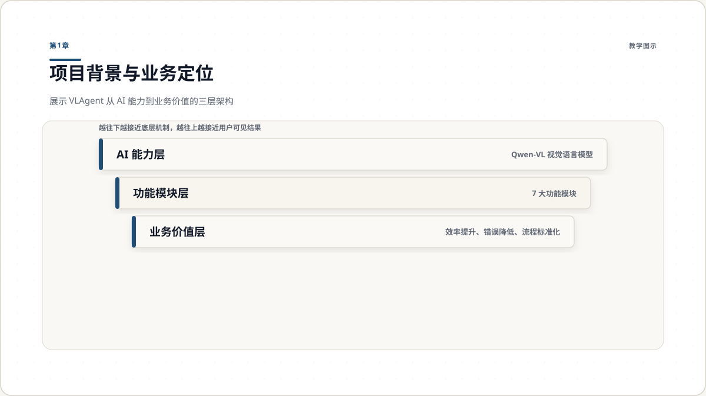
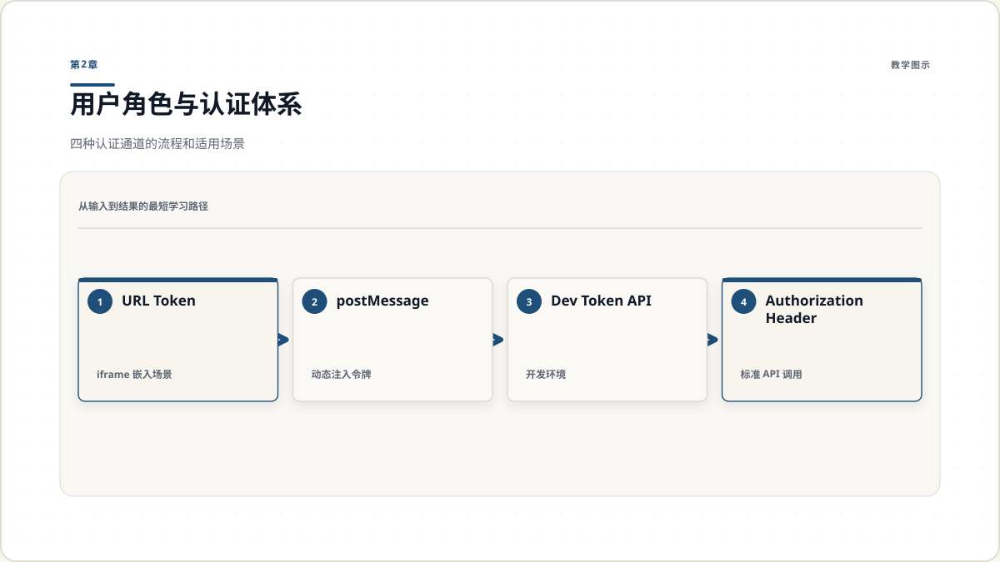
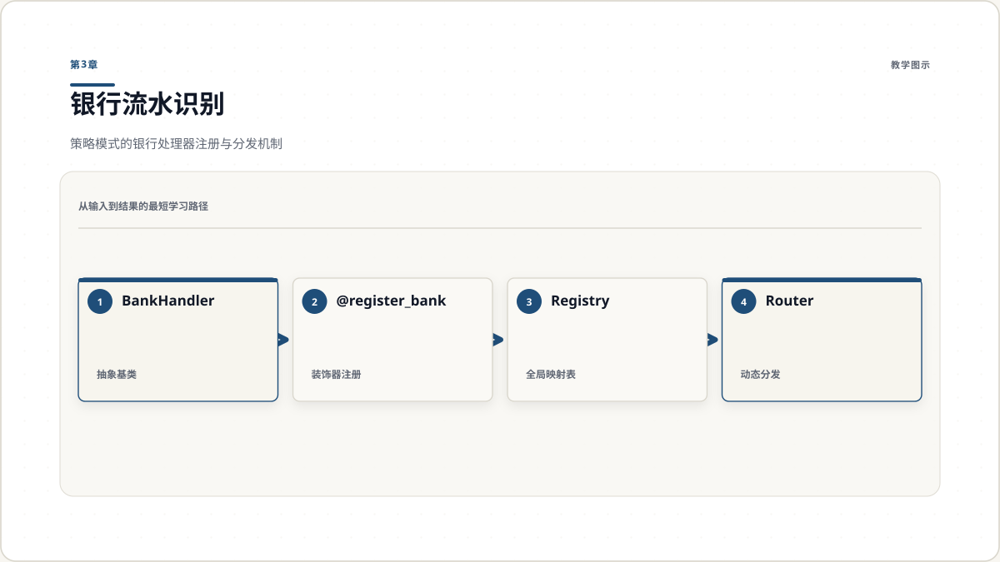
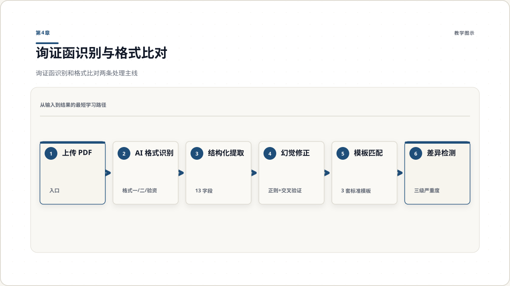
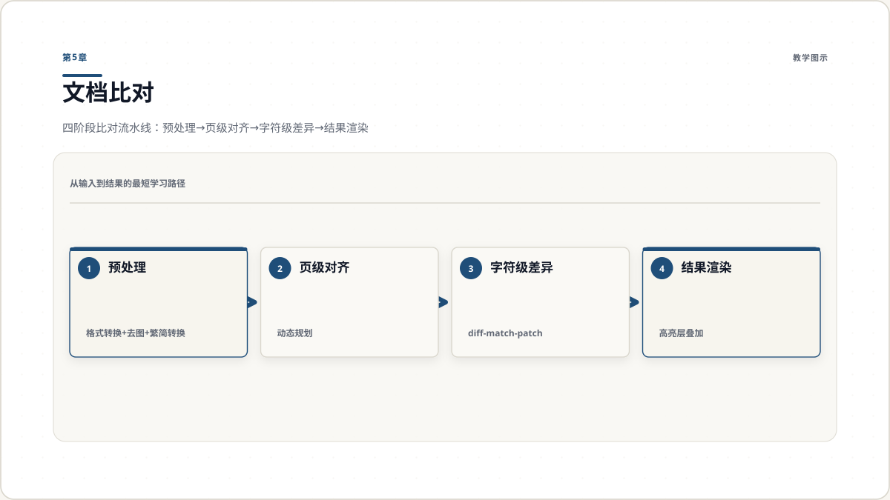
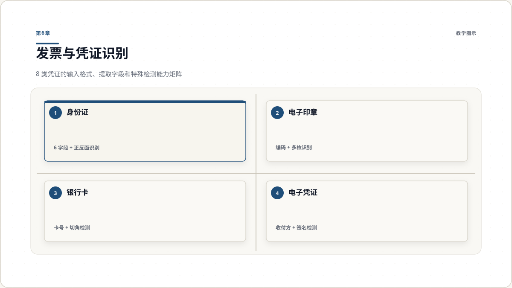
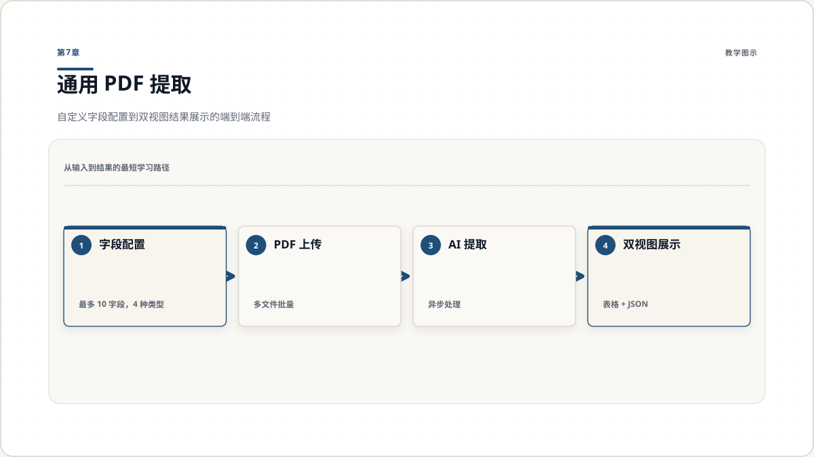
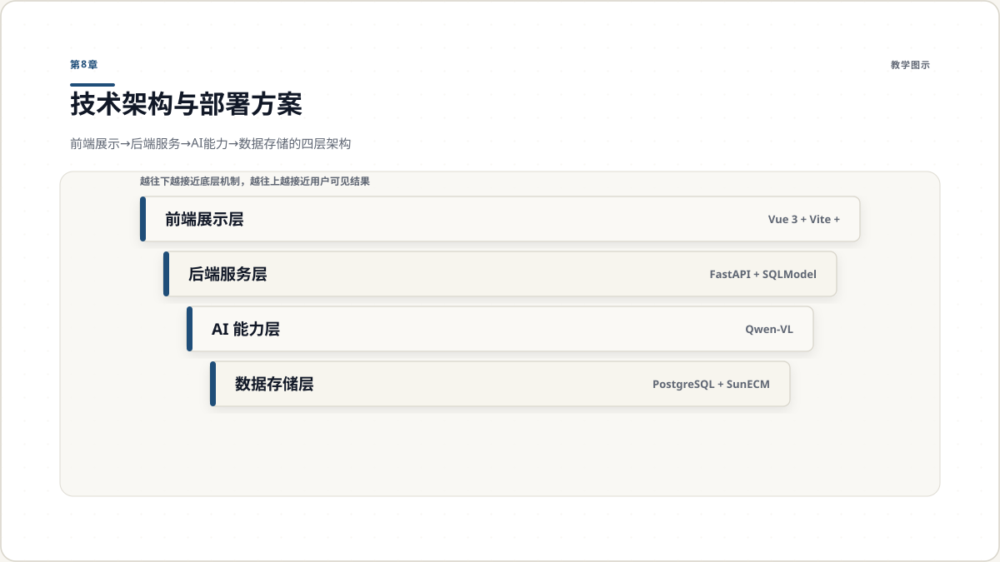
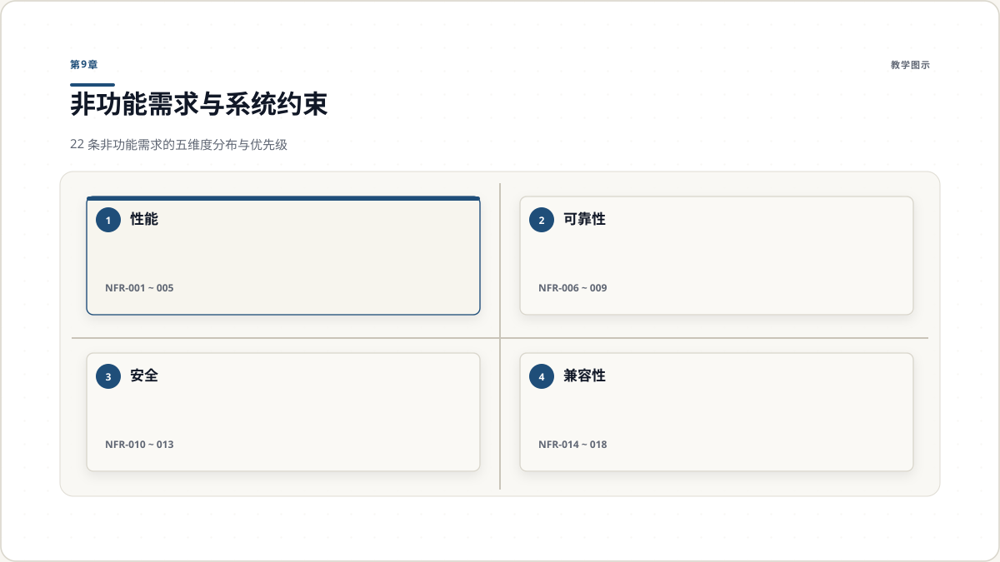
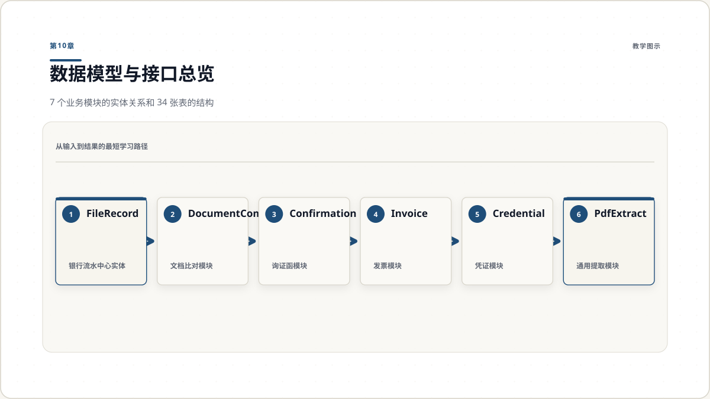

# VLAgent 智能文档识别平台 — 业务需求规格说明书

2026 年 4 月 30 日

---

审计年忙季，一名审计师面前的桌上堆着三家客户的银行流水 PDF、数十封银行询证函、两份待比对的合同版本。她需要逐笔核对流水金额、手工录入询证函上的 13 个字段、用肉眼逐字扫描两份合同的每一处修改。这是审计行业持续了数十年的日常——重复、耗时、极易出错。

VLAgent 正是为解决这一痛点而设计的 AI 智能文档识别平台。它面向审计、会计等金融行业场景，将文档上传、AI 识别、结构化提取与差异比对串成一条端到端的自动化链路。平台当前覆盖 7 大功能模块、支持 11 家银行的流水识别、8 类凭证的智能提取，以及字符级的文档差异比对。

本文档将完整呈现 VLAgent 的业务定位、功能需求、技术架构、数据模型与系统约束，为产品决策和技术实施提供统一的需求基线。

---

## 第1章 项目背景与业务定位

### 1.1 行业痛点：金融文档处理的人工困境

审计、会计等金融行业中，文档处理占据大量人力。核心痛点集中在三个环节：

**信息录入低效。** 银行流水、询证函、发票等文档中的结构化信息（金额、日期、账号等）需要人工逐项阅读和录入，一份 50 页的银行流水可能包含数百笔交易，逐笔录入耗时且容易发生抄写错误。

**版本比对困难。** 合同、协议等文档在修订过程中产生多个版本，审计人员需要逐字比对差异。当文档超过 10 页、且涉及繁体中文版本时，人工比对的准确率和效率急剧下降。

**凭证核验繁琐。** 身份证、银行卡、授权书等凭证的核验需要逐一检查各字段信息，而不同格式的凭证缺乏统一的信息提取标准。

### 1.2 产品定位

VLAgent 定位为**AI 驱动的金融文档智能处理平台**，核心能力覆盖三个层面：

- **识别**：通过 Qwen-VL 视觉语言模型，对 PDF 和图片文档进行 OCR 级别的信息识别
- **提取**：将非结构化文档信息转化为结构化数据（JSON/Excel），支持用户自定义字段
- **比对**：对两份文档进行字符级差异标注，自动处理繁简转换和图片干扰

### 1.3 核心价值主张

| 能力维度 | 传统人工方式 | VLAgent 方式 |
| --- | --- | --- |
| 银行流水录入 | 逐笔手动抄写 | AI 自动识别 + Excel 导出 |
| 询证函处理 | 逐字阅读提取 13 个字段 | AI 一次提取 + 幻觉校验修正 |
| 文档比对 | 逐页逐字肉眼扫描 | 字符级自动 diff + 可视化高亮 |
| 凭证核验 | 逐项人工检查 | AI 结构化提取 + 格式校验 |



---

## 第2章 用户角色与认证体系

### 2.1 目标用户画像

VLAgent 的用户群体分为两个核心角色：

**审计人员（主要用户）。** 负责上传银行流水、询证函、合同等文档，查看识别和比对结果，导出结构化数据。他们的核心诉求是减少重复劳动、提高核验准确性。

**系统集成方（技术对接方）。** 通过 iframe 将 VLAgent 嵌入到现有审计管理系统中，使用外部认证体系对接用户身份。他们的核心诉求是无缝集成、安全对接、功能模块按需启用。

### 2.2 认证方案

系统采用 JWT（HS256）令牌认证，根据部署场景提供四种认证通道：

| 编号 | 认证方式 | 适用场景 | 说明 |
| --- | --- | --- | --- |
| AUTH-001 | Authorization Header | 标准前端调用 | 所有 API 请求携带 `Bearer <token>` |
| AUTH-002 | URL 参数 `?token=` | iframe 嵌入 | 父系统在 URL 中注入令牌 |
| AUTH-003 | postMessage | iframe 动态注入 | 父窗口通过 postMessage 传递令牌，10 秒超时 |
| AUTH-004 | 开发令牌 `/api/dev-token` | 本地开发 | 生成 24 小时有效测试令牌 |

令牌载荷包含 `user_id`、`name`、`org_id`、`user_type` 字段，认证失败时自动跳转错误页面。

### 2.3 权限控制

系统实现了模块级权限控制（`permissions` 模块），支持按用户和模块维度配置访问权限。前端路由守卫在页面加载时检查用户对当前模块的访问权限，无权限时拒绝进入。



---

## 第3章 银行流水识别

### 3.1 业务场景

银行流水核对是审计工作中最高频的文档处理任务。审计人员需要从客户提供的银行流水 PDF 中提取账户汇总信息（户名、账号、日期范围、收支统计）和逐笔交易明细（日期、金额、余额、对方信息、摘要），用于后续的账目核对和分析。

### 3.2 功能需求

| 编号 | 需求 | 优先级 |
| --- | --- | --- |
| BS-001 | 支持上传 PDF 格式银行流水文件（单个或批量） | 高 |
| BS-002 | 自动检测银行类型（文件名关键词 + AI 图像分析） | 高 |
| BS-003 | 支持 11 家银行：工商、农业、中国、建设、交通、招商、光大、广发、邮储、济宁、山东地方银行 | 高 |
| BS-004 | 提取账户汇总信息：户名、账号、日期范围、收支笔数与金额 | 高 |
| BS-005 | 逐笔提取交易明细：交易时间、收支金额、余额、对方信息、摘要 | 高 |
| BS-006 | 根据银行类型展示定制化汇总组件 | 中 |
| BS-007 | 交易明细分页展示（每页 10 条） | 中 |
| BS-008 | 广发银行多汇总页场景：标签页切换 + 按汇总 ID 筛选明细 | 中 |
| BS-009 | 一键导出识别结果为 Excel（.xlsx） | 高 |
| BS-010 | 支持重新识别和删除文件 | 中 |
| BS-011 | 文件格式校验（magic bytes，非扩展名判断） | 中 |
| BS-012 | AI 分类验证：识别前校验文件是否为银行流水 | 中 |

### 3.3 策略模式架构

系统采用**策略模式**处理多银行差异。核心设计如下：

- **抽象基类 `BankHandler`**：定义统一接口（获取汇总、获取明细、创建记录、删除记录、导出 Excel、获取 Schema）
- **装饰器注册 `@register_bank`**：每个银行处理器通过装饰器自动注册到全局映射表
- **运行时分发 `get_bank_handler(bank_type)`**：根据 AI 识别的银行类型，动态选择对应处理器

这种设计使得新增银行支持时，只需实现一个新的 Handler 类并通过装饰器注册，无需修改核心路由和服务逻辑。

当前已注册的 11 家银行处理器：icbc（工商）、abc（农业）、boc（中国）、ccb（建设）、bocom（交通）、cmb（招商）、everbright（光大）、cgb（广发）、psbc（邮储）、jining（济宁）、shandong（山东地方）。



---

## 第4章 询证函识别与格式比对

### 4.1 询证函识别

银行询证函是审计过程中的核心确认文件，用于向银行核实被审计单位的账户信息。

**功能需求：**

| 编号 | 需求 | 优先级 |
| --- | --- | --- |
| CL-001 | 支持上传 PDF 格式询证函 | 高 |
| CL-002 | AI 提取 13 个关键字段：编号、事务所名称、回函地址、联系人、联系电话、邮编、借款账户、截止日期、起止日期、印章日期、印章名称、签名人姓名、收函银行 | 高 |
| CL-003 | 提取结果支持手动修正（PUT 接口更新） | 中 |
| CL-004 | 自动识别格式类型（格式一 / 格式二 / 验资询证函） | 高 |
| CL-005 | 将提取结果与标准模板校验，报告不符项 | 高 |
| CL-006 | AI 幻觉检测与修正：基于 13 条正则规则修正常见错误 | 高 |
| CL-007 | 日期字段交叉验证：词频分析纠正误识别日期 | 中 |
| CL-008 | 电话号码标准化：统一格式，去除中文括号注释 | 中 |
| CL-009 | 银行名称多级正则匹配（XX 银行 XX 分行 XX 支行 XX 营业部） | 高 |

**AI 幻觉修正机制**是询证函识别的关键质量保障。系统在 AI 返回结果后，自动执行三重校验：正则规则匹配修正明显错误、日期字段交叉验证确保时间逻辑一致、词频分析纠正 AI 对高频词汇的误识别。

### 4.2 询证函格式比对

格式比对功能允许用户上传询证函 PDF，系统自动识别其格式类型，与内置标准模板逐项比对，报告格式差异。

**功能需求：**

| 编号 | 需求 | 优先级 |
| --- | --- | --- |
| FC-001 | 支持上传 PDF 格式询证函 | 高 |
| FC-002 | 内置 3 套标准模板：格式一、格式二、验资询证函 | 高 |
| FC-003 | AI 自动识别格式类型（基于内容结构判断） | 高 |
| FC-004 | AI 提取文档结构：节次名称、表格列标题、补充描述、子节 | 高 |
| FC-005 | 逐项比对：节次数量、名称、表格表头 | 高 |
| FC-006 | 差异严重度分级：高（结构缺失）、中（数量不符）、低（多余字段） | 中 |
| FC-007 | 并排展示模板 PDF 和上传文件 PDF | 中 |
| FC-008 | 并排展示模板结构与 AI 提取结构，不符项红色高亮 | 高 |



---

## 第5章 文档比对

### 5.1 业务场景

合同、协议、招股书等文档在审计过程中经历多次修订，审计人员需要精确标注每个版本的文本差异。当文档超过数十页、涉及繁简体中文混排、包含大量图片时，人工比对几乎不可能做到精确。

### 5.2 核心能力

文档比对模块提供**页级自动对齐 + 字符级差异标注**的双重比对能力。

**功能需求：**

| 编号 | 需求 | 优先级 |
| --- | --- | --- |
| DC-001 | 支持 PDF、DOCX、DOC 格式（单文件最大 50MB） | 高 |
| DC-002 | DOCX/DOC 自动通过 LibreOffice 转 PDF | 高 |
| DC-003 | 自动检测并拒绝伪装为 Word 的 MHTML 文件 | 中 |
| DC-004 | 比对前自动去除 PDF 图片，仅保留文本 | 高 |
| DC-005 | 去图 PDF 同步用于前端展示，确保高亮位置对齐 | 高 |
| DC-006 | 繁体中文自动转简体后比对 | 高 |
| DC-007 | 页级自动对齐：动态规划算法处理不等页数 | 高 |
| DC-008 | 字符级差异计算：diff-match-patch 算法 | 高 |
| DC-009 | 差异分类：equal / modified / added / deleted | 高 |
| DC-010 | 内容一致性检测：字符频率分析判断排版不同但内容相同 | 中 |
| DC-011 | 并排展示 PDF + 字符级高亮层（红色删除、绿色新增） | 高 |
| DC-012 | 侧边栏展示页面对比对状态，支持按类型筛选 | 中 |
| DC-013 | 侧边栏差异文本预览（删除线 + 绿色背景） | 中 |
| DC-014 | 比对任务历史记录查看和删除 | 中 |
| DC-015 | 异步处理 + 3 秒轮询 | 高 |

### 5.3 比对算法流程

文档比对采用**四阶段流水线**：

1. **预处理**：DOCX → PDF 转换 → 去除图片 → 繁简转换 → 纯文本提取
2. **页级对齐**：使用动态规划算法将两份文档的页面进行最优匹配，处理页数不一致的情况
3. **字符级差异**：对每对匹配页面使用 diff-match-patch 算法计算字符级差异，输出差异操作数组
4. **结果渲染**：前端在 PDF 页面上叠加高亮层，精确标注每个字符的增加和删除

差异操作数据格式为 `[[op, text, offset_a, offset_b], ...]`，其中 `op` 取值 -1（删除）、0（相同）、1（新增），支持精确到字符的位置定位。



---

## 第6章 发票与凭证识别

### 6.1 发票识别

发票识别支持 PDF 和图片格式（JPG/PNG），批量上传后异步处理。

**功能需求：**

| 编号 | 需求 | 优先级 |
| --- | --- | --- |
| IR-001 | 支持 PDF、JPG、PNG 格式，支持多文件批量上传 | 高 |
| IR-002 | PDF 自动按页拆分为图片，逐页识别 | 高 |
| IR-003 | AI 提取 8 个字段：发票类型、发票号码、开票日期、发票金额、购买方名称、购买方税号、销售方名称、销售方税号 | 高 |
| IR-004 | 按页展示识别结果卡片 | 中 |
| IR-005 | 原始文件预览（PDF iframe / 图片 img） | 中 |
| IR-006 | 异步批量处理 + 前端轮询 | 高 |
| IR-007 | 支持识别结果删除 | 低 |

### 6.2 凭证识别

凭证识别覆盖审计场景中常见的 8 类凭证文件，每类凭证有独立的字段提取规则和结果展示组件。

**支持的凭证类型与提取字段：**

| 凭证类型 | 提取字段 | 特殊能力 |
| --- | --- | --- |
| 身份证 | 姓名、性别、民族、出生日期、住址、身份证号 | 自动识别正面/背面 |
| 电子印章 | 印章编码 | 多枚印章识别 + 防幻觉校验 |
| 银行卡 | 卡号 | 切角检测（作废标记） |
| 电子凭证 | 付款方/收款方信息、金额 | 手写签名检测 |
| 网银申请书 | 操作员信息、权限列表 | 签章检测 |
| 违法告知函 | 相关信息 | 指纹检测 |
| 开户申请书 | 完整申请表信息 | 复选框勾选状态检测（链式推理） |
| 授权书 | 15 项分类授权项目（开户/变更/注销/其他） | 勾选状态检测 |

**图像预处理能力：**

- 密集表单图片自动网格切割，分区域识别后合并结果
- 多表单并排图片自动水平切割
- 布尔字段后处理：修正 AI 对勾选标记的误判



---

## 第7章 通用 PDF 提取

### 7.1 自定义字段配置

通用 PDF 提取模块允许用户定义提取字段 schema，AI 从任意 PDF 中按定义提取结构化信息。

**字段类型系统：**

| 类型 | 说明 | 示例 |
| --- | --- | --- |
| string | 单行文本 | 公司名称、合同编号 |
| number | 数值 | 金额、数量 |
| array | 字符串数组 | 股东名单、经营范围 |
| object_array | 对象数组（支持子字段定义） | 董事信息（姓名+职务+任期） |

配置规则：最多 10 个提取字段；object_array 类型支持定义子字段（名称、类型、描述）。

### 7.2 输出格式与结果展示

| 编号 | 需求 | 优先级 |
| --- | --- | --- |
| PE-001 | 用户可配置最多 10 个提取字段 | 高 |
| PE-002 | 每字段支持配置名称、类型、描述 | 高 |
| PE-003 | object_array 类型支持子字段定义 | 中 |
| PE-004 | 支持输出格式：JSON、CSV、XLSX | 高 |
| PE-005 | 多文件批量上传 + 异步处理 | 高 |
| PE-006 | 双模式展示：表格视图 + JSON 原始视图 | 中 |
| PE-007 | 支持复制 JSON 到剪贴板、下载 JSON 文件 | 低 |
| PE-008 | 支持后端生成的 CSV/XLSX 下载 | 中 |



---

## 第8章 技术架构与部署方案

### 8.1 前后端技术栈

| 层级 | 后端技术 | 前端技术 |
| --- | --- | --- |
| 语言 | Python >= 3.11 | TypeScript 5.9 |
| 框架 | FastAPI + Uvicorn（异步） | Vue 3.5（Composition API） |
| 构建 | uv（pyproject.toml） | Vite 7 |
| ORM/数据 | SQLModel + asyncpg + PostgreSQL | Axios（HTTP） |
| AI 接入 | OpenAI 兼容 SDK → Qwen-VL | — |
| PDF 处理 | pdfplumber、PyMuPDF、pdf2image、camelot | pdfjs-dist（PDF.js 渲染） |
| 文档转换 | LibreOffice headless（DOCX → PDF） | — |
| 比对引擎 | diff-match-patch、difflib | TipTap（diff 可视化） |
| 简繁转换 | OpenCC | — |
| 认证 | PyJWT（HS256） | sessionStorage + postMessage |
| 样式 | — | Tailwind CSS 4 |
| 导出 | pandas + openpyxl（Excel） | — |
| 外部集成 | JPype1（SunECM Java SDK 桥接） | — |

### 8.2 系统架构分层

系统采用经典的三层架构，前后端完全分离：

```
┌─────────────────────────────────────────────┐
│          前端展示层（Vue 3 + Vite）           │
│  9 个页面视图 · 11 个银行汇总组件 · 认证守卫  │
├─────────────────────────────────────────────┤
│          后端服务层（FastAPI + SQLModel）      │
│  11 个业务模块 · 57 个 API 端点 · 异步任务    │
├─────────────────────────────────────────────┤
│          AI 能力层（Qwen-VL）                 │
│     视觉语言模型 · 多模态文档理解              │
├─────────────────────────────────────────────┤
│          数据与存储层                          │
│  PostgreSQL（34 张表）· SunECM（可选集成）     │
└─────────────────────────────────────────────┘
```

### 8.3 部署架构

- **容器化部署**：后端和前端各自提供 Dockerfile，通过 Kubernetes Helm Charts 编排
- **前端部署**：多阶段构建（Node.js 编译 → OpenResty/Nginx 托管），端口 8001，Nginx 反代 `/api` 至后端
- **后端部署**：自定义运行时镜像，非 root 用户（appuser），tini 作为 init 进程，`/health` 健康检查
- **CI/CD**：Jenkins 流水线（ci-prepare → ci-build → ci-push），nerdctl 构建推送至私有 Harbor 镜像仓库
- **嵌入部署**：支持 iframe 嵌入模式，通过 postMessage 从父系统获取认证令牌



---

## 第9章 非功能需求与系统约束

### 9.1 性能需求

| 编号 | 需求 |
| --- | --- |
| NFR-001 | PDF 文本提取响应时间 ≤ 5 秒/页（不含 AI 调用） |
| NFR-002 | 文档比对异步处理，不阻塞其他 API 请求 |
| NFR-003 | 数据库连接池：最小 5 连接，最大 10 溢出，300 秒回收 |
| NFR-004 | AI 识别超时保护：单文件最长 1800 秒 |
| NFR-005 | 大图片自动压缩（尺寸 + 质量）后发送 AI，降低推理延迟 |

### 9.2 可靠性需求

| 编号 | 需求 |
| --- | --- |
| NFR-006 | AI 返回 JSON 自动修复（括号补全、Markdown 围栏清除、控制字符转义） |
| NFR-007 | DOCX 转 PDF 失败时返回明确错误信息，不中断服务 |
| NFR-008 | 异步任务失败时记录错误信息，状态标记为 failed |
| NFR-009 | 数据库表结构自动迁移（启动时 ALTER TABLE 补列） |

### 9.3 安全需求

| 编号 | 需求 |
| --- | --- |
| NFR-010 | 所有 API 接口（除公开端点外）需 JWT 认证 |
| NFR-011 | 文件上传路径安全校验，防止目录穿越攻击 |
| NFR-012 | 上传文件格式校验（magic bytes 检测） |
| NFR-013 | JWT 令牌包含过期时间，过期后拒绝访问 |

### 9.4 兼容性与可维护性

| 编号 | 需求 |
| --- | --- |
| NFR-014 | 支持 PDF、DOCX、DOC、JPG、JPEG、PNG 格式输入 |
| NFR-015 | 支持简体中文和繁体中文文档的识别与比对 |
| NFR-016 | HiDPI/Retina 屏幕适配（PDF canvas 按 devicePixelRatio 缩放） |
| NFR-017 | 支持主流浏览器：Chrome、Edge、Firefox、Safari |
| NFR-018 | 支持 iframe 嵌入部署 |
| NFR-019 | 银行识别策略采用注册式策略模式，新增银行无需修改核心逻辑 |
| NFR-020 | 提示词和字段 Schema 通过配置文件管理 |
| NFR-021 | 容器化部署，提供 Dockerfile 和 Kubernetes Helm Charts |
| NFR-022 | 前后端完全分离，独立构建和部署 |



---

## 第10章 数据模型与接口总览

### 10.1 核心实体关系

```
FileRecord（银行流水文件）
├── {Bank}Summary（账户汇总，11 家银行各一张表）
└── {Bank}Transaction（交易明细，11 家银行各一张表）

DocumentCompareTask（文档比对任务）
└── DocumentPageDiff（页级差异，1:N）

ConfirmationFile（询证函文件）
└── ConfirmationResult（识别结果，1:1）

FormatCompareTask（格式比对任务）

InvoiceFile（发票文件）
└── InvoiceResult（识别结果，1:N 按页）

CredentialRecord（凭证记录）
└── CredentialResult（提取结果，1:1）

PdfExtractTask（PDF 提取任务）
└── PdfExtractResult（提取结果，1:1）

UserPermission（用户权限）
```

所有业务表均包含 `user_id` 字段，实现多租户数据隔离。

### 10.2 数据库表统计

| 类别 | 表数量 | 说明 |
| --- | --- | --- |
| 银行流水相关 | 23 | files + 11 张 summary + 11 张 transaction |
| 文档比对 | 2 | compare_tasks + page_diffs |
| 询证函识别 | 2 | confirmation_files + confirmation_results |
| 格式比对 | 1 | format_compare_tasks |
| 发票识别 | 2 | invoice_files + invoice_results |
| 凭证识别 | 2 | credential_records + credential_results |
| PDF 提取 | 2 | pdf_extract_tasks + pdf_extract_results |
| **合计** | **34** | |

### 10.3 API 接口总览

所有 API 以 `/api` 为前缀，除文件获取和公开端点外均使用 POST 方法，请求和响应均为 JSON 格式。

| 模块 | 路由前缀 | 端点数 | 核心功能 |
| --- | --- | --- | --- |
| 认证 | `/api/auth` | 1 | 开发令牌获取 |
| 银行流水 | `/api/files` | 6 | 上传、识别、删除、导出 |
| 交易记录 | `/api/transactions` | 2 | 汇总查询、明细查询 |
| 文档比对 | `/api/documents` | 6 | 创建任务、查询状态、获取差异、历史管理 |
| 询证函 | `/api/confirmation` | 7 | 上传、识别、更新、删除 |
| 格式比对 | `/api/format-compare` | 8 | 上传、识别、比对、结果查询 |
| 发票识别 | `/api/invoice_recognition` | 5 | 上传、识别、结果查询、删除 |
| 凭证识别 | `/api/credentials` | 5 | 上传、识别、结果查询、删除 |
| PDF 提取 | `/api/pdf_extract` | 5 | 上传、识别、结果查询、删除 |
| 文档管理 | `/api/file-provider` | 4 | SunECM 平台文档存取 |
| 原生流水 | `/api/native-statement` | 3 | 原生 PDF 解析 |
| **合计** | | **57** | |

异步任务状态流转：`pending → processing → done / failed`。前端采用 3 秒间隔轮询获取任务状态更新。



---

## 附录 A 外部依赖

| 依赖 | 用途 | 是否必需 |
| --- | --- | --- |
| Qwen-VL（通义千问视觉语言模型） | 文档图像理解和信息提取 | 是 |
| PostgreSQL | 数据持久化存储 | 是 |
| LibreOffice | DOCX/DOC 转 PDF | 文档比对必需 |
| Poppler（pdf2image 依赖） | PDF 转图片 | 是 |
| Camelot（OpenCV） | PDF 表格提取（原生流水解析） | 原生流水功能必需 |
| SunECM 文档管理平台 | 外部文档存取 | 可选，通过配置启用 |

## 附录 B 术语表

| 术语 | 定义 |
| --- | --- |
| 流水 | 银行账户交易明细记录 |
| 询证函 | 审计过程中向银行发送的确认函，用于核实企业账户信息 |
| 凭证 | 身份证、银行卡、授权书等身份或业务类文件 |
| 原生 PDF | 含可提取文本层的电子 PDF（非扫描件） |
| diff | 两段文本之间的字符级差异 |
| 幻觉检测 | 检测和修正 AI 模型生成的虚假或不准确内容 |

## 附录 C 约束与假设

**约束：**
- AI 模型依赖外部 API 服务，识别准确率受模型能力限制
- DOCX 转 PDF 依赖 LibreOffice，转换质量取决于原始文档复杂度
- 原生 PDF 文本提取对扫描件无效（扫描件需走 AI 识别路线）
- 单文件上传大小限制 50MB

**假设：**
- 用户上传的文档为有效且可读的文件
- 银行流水 PDF 的排版在各银行内部相对统一
- 询证函格式遵循国家标准模板
- AI 模型 API 服务可用且响应稳定
